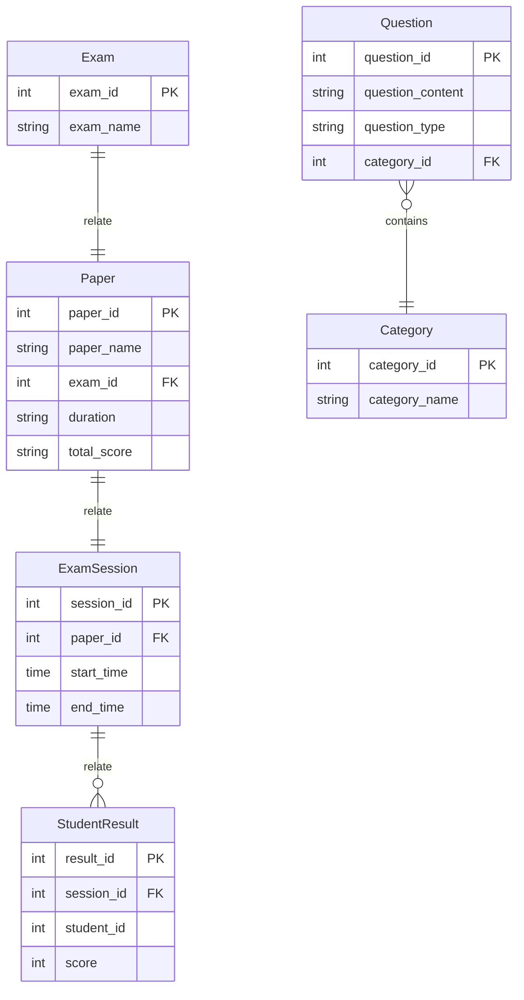
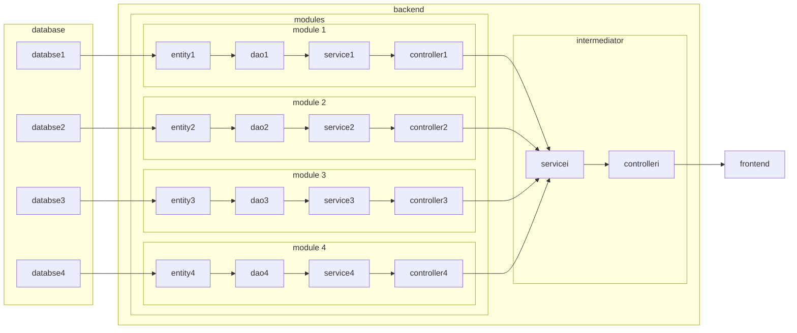
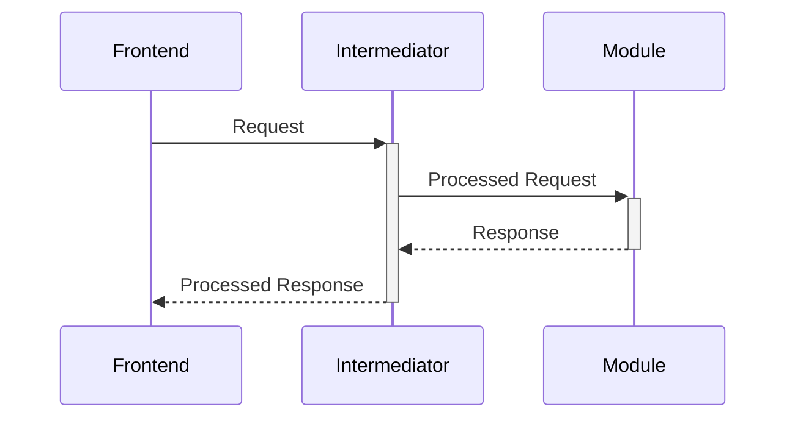
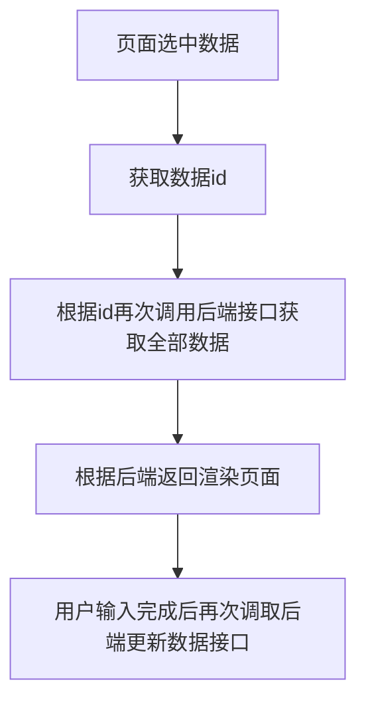

> 本文首发于个人博客 \
> 发表日期：2023.4.28

大四下最后的一门课也结束了。这门课大体是由数个人组成一个小小团体进行一个小小项目从零到一的完整开发过程，不同于其他课程，这个项目要求以类似于实际开发的模式，让所有参与者都经历由需求确定、初期架构设计到中期开发、版本发布甚至于是需求变更以及迭代的完整软件开发的整个生命周期。当然其中也包括不同团队间的沟通协商。

大体而言我在其中以项目经理、架构设计、团队Leader等各种身份参与了后端的完整开发，并也作为开发者参与到了前端部分的开发任务中。个人从中确实有不少感悟，故而写此文记录。在这里主要想谈谈设计、开发的一些感想，诸如进度管理、质量把控等等可能也略有涉及。

# 项目背景

大体而言这个课程项目要求做一个宠物医院的线上学习平台，主要受众大概就是即将毕业或是正在大学学习的兽医相关专业的学生。其功能简要来讲大概有这么几类：

- 用户管理与鉴权：常规的大系统都有的功能，这里大体上就分为管理员、出题的老师和进行学习的学生三类用户。
- 一个完整医院的3D全景地图与导览模型：前端开发为主的功能，本文不涉及。
- 系统管理：要求对这个宠物医院内诸如药物、档案、收费项目、各类检查项目、住院者的信息等等各类内容进行管理，不过这个东西似乎没有在需求文档中体现出实际的意义与用处。
- 病例管理：大体上是需要把来医院就诊过的各类病例收集起来存储，其包括从入院诊断、具体检查到诊断结果与治疗方案等全过程的文字图片视频信息，当然也包括得的病的信息。
- 测试管理：由病例管理上游的疾病部分内容衍生而来。老师根据疾病生成题库，并从中选题整理为试卷。学生则参加考试进行答题。不过这部分内容似乎与虚拟宠物医院没有太大关系。
- 职能学习：一方面是让学生去学习疾病的相关知识（当然要看文字图片视频），一方面学生也可以通过看文字图片视频学习医院内各类角色（医生、医助等等）的具体操作内容。
- 数据管理：和上面提到的图片视频的存储有关。需求上还挺麻烦的，视频格式支持太多还需要进行视频的格式转换，反应到和用户的交互上来说还需要实现分块上传等功能等。

尽管后文对具体业务尽量不会涉及，但姑且将背景记于这里。不难看出这个项目还是一个比较传统的要用到数据库后端前端三个维度的项目，因而后文也主要想从这三个维度的设计与开发两方面来聊聊。

项目可以参考：

- [后端](https://github.com/SoftwareDevelopmentPractice6/virtualPetHospital-backend)
- [前端](https://github.com/SoftwareDevelopmentPractice6/virtualPetHospital-frontend)

本博客的仓库中也保存了相关的源码，可以参考[这里](https://github.com/pikapikapikaori/pikapikapi-blog/tree/master/resource/ITtech/SoftwareDevelopementInsights-20230428)。

# 设计

由于课程要求重各类文档，因而并没有采取如今主流的敏捷开发模式，而是采取的[RAD](#RAD)模型。个人来讲其实并不是很习惯这个模型，一方面其由瀑布式改进而来，从某种角度上还是非常重文档和前期的设计的，对需求的变更与过程中的变化并不敏感，另一方面也是因此在开发过程中的抗风险能力也非常依赖于前期的设计以及开发过程中的质量，由此带来的风险是非常恐怖的。

总之也是因此在进行前期设计时就花了相当多的时间。然而尽管如此，初期的设计还是有着比较大的漏洞，因而也给后期开发带来了一些麻烦。这些问题大多集中在数据库设计上。

## 数据库设计

由于项目较为庞大因而一些细节的设计我也没有来得及能够去亲自把控，而是交给了同组的其他人。在这里就出了问题。上文所述的测试管理中，题库中的问题需要记录与其相关的问题类别（属于哪种病）、问题类型（单选多选）、问题内容等等。针对此负责这块内容的组员A给出了这样的设计：



且不谈同学A遗漏了需要对每张卷子上包含的题目、以及每位学生在试卷上答题所做出的回答进行存储的功能，单看`Question`与`Category`两张表。乍一看虽然是挺合理的设计，然而后者的实际有效字段只有`category_name`一栏。我不否认在大型项目中这样设计的合理性，但是考虑到这个项目的规模、以及后续可能会进行的功能上的拓展，我个人看来`Category`这张表完全冗余的。

另一方面，`Exam`、`Paper`、`ExamSession`这三张一对一的表虽然也是很符合设计原则的设计，但是同样考虑到项目规模与未来可能的拓展，这三张表就算合在一起也不会对性能与吞吐量带来很大的负担。一般来讲，只有在表中有一栏以上可能包含大量空值的情况下，或是某一些栏可能被频繁更新时，一对一关系的设计才相对合理。而在当前的情形中，这样的设计则是给后期撰写`SQL`与开发上带来了巨大的麻烦。且不谈数据的整合与处理，仅仅是外键的存在就已经带来了巨大的麻烦。这也直接导致了在后期初始化数据`SQL`撰写上耗费了大量Debug的时间，在开发的编码中也需要增加大量检测外键存在性的不必要代码。

## 后端架构设计

初期设计时我就已经敲定了[微服务](#微服务)的架构。通常，微服务确实不适合于本项目这样的小型项目：配置麻烦、DevOps麻烦，等等。此外，大型项目中服务间数据一致性以及安全性都是非常棘手且关键的问题。

不过事实上，我其实很看重松散耦合这一点。其给后期开发与迭代过程中带来的自由度是相当大的。前述的问题，如配置、DevOps的确相对棘手，不过包含公用模块、各类插件的配置在初期完成后便一了百了，运维上利用Docker与统一的脚本进行自动化管理也是一经配置后就极易使用的，并没有给开发人员带来很高的成本。倘若有购买服务器配置Jenkins进行更多的自动化的话，相关成本应该还能进一步降低。

实践中，jacoco、spotless、公共模块的配置实质上也仅仅耗费了我半天的时间，而后期部署时自动化测试脚本的编写仅仅耗费了我两个小时不到的时间。接口测试上所花费的时间略多一点，不过由于接口测试脚本基本是直接由swagger生成的，因而也没有耗费太多的成本。

相较于这些仅局限于初期和末期的麻烦而言，微服务架构带来的好处是实打实巨大的。数据库与模块的分离带来的是各模块开发的高独立性以及运行时的高可用性。前文所提到的数据库尽管经常会碰到组员产生的Bug，但分离的数据库使得其余的几个模块并没有受到影响从而能够很顺利的进行开发。另一方面，后端模块的分离使得几个模块都能够被快速地开发出来，也因此能够较早地将接口给到前端，从而留出了大量可用于迭代的时间。产生缺陷时查找定位的范围仅仅在自身的子系统内，因而定位缺陷的成本也略有降低。而最最重要的，由于模块间的松散耦合，即使一个服务失败其他服务也能够继续工作，这给开发与测试都带来了相当程度上的便捷。

更具体的，微服务给实践中的开发带来了巨大的便捷性。我在项目中大概采取了下图的架构：



作为微服务而言其实也是非常常见与合理的架构。中间层充当网关的角色被外部服务（前端）统一调用，其内部则再根据具体的调用请求来选择合适的服务进行通信，并将数据进行处理后转发给外部服务。在实践中，前端组与后端组同时开发，需求细节与开发细节还不明了的情况下，接口的内容与种类尽管可以大体确定，但具体的数据内容与种类等都是难以确定的。因而，利用中间层也即网关这一角色，接口确定的难题得以被解决。前后端可以先按照自己的想法对接口进行设计与模拟，当有一定的进度、对接口需求更加明确时再利用中间层进行数据的整合与处理，从而节约了大量沟通与修改的时间。



实践上，数据的转发与整合可以由后端的网关接管，也可以由前端利用nodejs来开发，无论哪种都是非常灵活的。事实上，nodejs构建的中间层或称node层的出现，就是为了让前后端都更关注于业务本身。尽管层数的增加可能会给性能带来一些影响，然而这与开发效率所节省的成本相比是微乎其微的。由过去后端渲染html发送给浏览器的前后端不分离，到前后端分离开发再到中间层的进化，我想这是一个相当自然的过程，也非常值得去学习与应用。

此外，采取微服务架构，后期的扩展性也是相当高的。一方面，需要增加新业务时可以直接以模块为单位进行添加，而不需要再去对原有代码进行改动。另一方面，甚至也可以将同一服务运行在多台服务器上，并利用Eureka、Ribbon等等组件进行负载均衡与健康检查的功能，从而能够进一步提升可用性与性能，这些都是单体应用难以带来的好处。

当然，微服务的思想也能直接应用到前端上，也就是前些年提出的[微前端](#微前端)的思想。似乎前端组也有利用这一思想进行开发，不过本文就先不作赘述了。

# 开发

## 后端开发仍存在的问题

开发上后端直接采用了SpringBoot的四层架构，基本上实现了增删改查四类功能。同时，调数据库方面使用了JPA。

需求上，为了满足全字段搜索、以及较简单的增删改功能，考虑到开发上的便捷性，查询相关的业务逻辑大体都是采取了下面的写法：

```java
public JSONObject getFeature(
        Integer funcId,
        String funcName,
        String funcDescription,
        String funcFlow,
        String funcRole,
        String funcTool,
        String roomName) {
    JSONObject res = new JSONObject();
    res.put(
            Constants.featureList,
            JSONObject.parseArray(JSON.toJSONString(featureRepository.findAll().stream()
                    .filter(feature -> SearchJudgeHelper.softEquals(funcName, feature.getFuncName())
                            && SearchJudgeHelper.softIncludes(funcDescription, feature.getFuncDescription())
                            && SearchJudgeHelper.softIncludes(funcFlow, feature.getFuncFlow())
                            && SearchJudgeHelper.softIncludes(funcRole, feature.getFuncRole())
                            && SearchJudgeHelper.softEquals(funcTool, feature.getFuncTool())
                            && SearchJudgeHelper.softEquals(
                                    roomName, feature.getFeatureRoom().getRoomName())
                            && SearchJudgeHelper.softEquals(funcId, feature.getFuncId()))
                    .collect(Collectors.toList()))));
    return ResponseHelper.constructSuccessResponse(res);
}
```

先说查询逻辑。为了少写`SQL`因而这里是直接调用了JPA的`findAll`方法，随后利用`Java`的流函数对其进行遍历筛选，由此得到目标结果以返回。判断相等或包含的方法由自建类进行处理，以满足空数值的比较操作，例如：

```java
public static Boolean softEquals(String toBeJudged, String referencedValue) {
    try {
        return (Objects.equals(toBeJudged, null) || Objects.equals(toBeJudged, ""))
                ? true
                : Objects.equals(referencedValue, URLDecoder.decode(toBeJudged, Constants.UTF8));
    } catch (UnsupportedEncodingException e) {
        return false;
    }
}
```

小型项目中这样的写法大体上是没什么问题的，但如果遇上较大的项目这样的写法绝对会出很大的问题。一来，论谁都能看出的遍历查询的性能问题，在十万级别数据量下大概就能有很直观的感受了，这一工作本来应该在数据库中利用索引来优化解决。二来，大量的吞吐量给服务器带来了IO上巨大负担。其潜在的风险是难以估量的。

为了在满足需求的基础上尽可能简化开发上的工作量（即少写`SQL`与对应的函数），我目前的想法是利用正则表达式（例如MySQL中的`REGEXP`关键字）进行查询，由此将查询的相关工作返还给数据库。利用数据库内部的索引等机制对查询进行优化（MySQL内部索引的B+树能带来数倍的性能），借此来消除服务器的负担。借由这一方法全字段搜索可以通过唯一的一条`SQL`来实现，也符合尽量不写`SQL`的原则。

```java
// Dao层
@Query(value = "SELECT f.* FROM Feature f WHERE (f.name REGEXP :funcNameRegExp) AND (f.description REGEXP :funcDescriptionRegExp)", nativeQuery = true)
ArrayList<Feature> findFeatureByRegExp(@Param("funcNameRegExp") String funcNameRegExp, @Param("funcDescriptionRegExp") String funcDescriptionRegExp);

// Service层
public JSONObject getFeature(
        String funcName,
        String funcDescription) {
    String funcNameRegExp = funcName;
    String funcDescriptionRegExp =  "^" + funcName + "$";
    JSONObject res = new JSONObject();
    res.put(
            Constants.featureList,
            JSONObject.parseArray(JSON.toJSONString(featureRepository.findFeatureByRegExp(funcNameRegExp, funcDescriptionRegExp))));
    return ResponseHelper.constructSuccessResponse(res);
}
```

再说增删改。项目中这些功能的实现大体如下：

```java
\\ 增
public JSONObject addExamine(String examineName, double examinePrice, String roomName) {
    List<Examine> targetExamineList = examineRepository.findAll().stream()
            .filter(examine -> Objects.equals(examine.getExamineName(), examineName))
            .collect(Collectors.toList());

    if (Objects.equals(targetExamineList.size(), 0)) {
        Optional<Room> targetRoomOptional = roomRepository.findById(roomName);

        if (targetRoomOptional.isEmpty()) {
            return ResponseHelper.constructFailedResponse(ResponseHelper.requestErrorCode);
        } else {
            Examine newExamine = new Examine();
            newExamine.setExamineName(examineName);
            newExamine.setExaminePrice(examinePrice);
            newExamine.setExamineRoom(targetRoomOptional.get());

            Examine addedExamine = examineRepository.saveAndFlush(newExamine);

            return ResponseHelper.constructSuccessResponse(addedExamine);
        }
    } else {
        return ResponseHelper.constructFailedResponse(ResponseHelper.requestErrorCode);
    }
}

\\ 改
public JSONObject updateExamine(int examineId, String examineName, double examinePrice, String roomName) {
    Optional<Examine> targetExamineOptional = examineRepository.findById(examineId);

    if (targetExamineOptional.isEmpty()) {
        return ResponseHelper.constructFailedResponse(ResponseHelper.requestErrorCode);
    } else {

        List<Examine> targetExamineList = examineRepository.findAll().stream()
                .filter(examine -> Objects.equals(examine.getExamineName(), examineName)
                        && !Objects.equals(examine.getExamineId(), examineId))
                .collect(Collectors.toList());

        Optional<Room> targetRoomOptional = roomRepository.findById(roomName);

        if (targetRoomOptional.isEmpty() || !Objects.equals(targetExamineList.size(), 0)) {
            return ResponseHelper.constructFailedResponse(ResponseHelper.requestErrorCode);
        } else {
            Examine targetExamine = targetExamineOptional.get();
            targetExamine.setExamineName(examineName);
            targetExamine.setExaminePrice(examinePrice);
            targetExamine.setExamineRoom(targetRoomOptional.get());

            Examine updatedExamine = examineRepository.saveAndFlush(targetExamine);

            return ResponseHelper.constructSuccessResponse(updatedExamine);
        }
    }
}

\\ 删
public JSONObject deleteExamine(int examineId) {
    Optional<Examine> targetExamineOptional = examineRepository.findById(examineId);

    if (targetExamineOptional.isEmpty()) {
        return ResponseHelper.constructFailedResponse(ResponseHelper.requestErrorCode);
    } else {
        examineRepository.deleteById(examineId);

        if (examineRepository.findById(examineId).isEmpty()) {
            return ResponseHelper.constructSuccessResponse(targetExamineOptional.get());
        } else {
            return ResponseHelper.constructFailedResponse(ResponseHelper.requestErrorCode);
        }
    }
}
```

说实话每个表增删改查写一遍还是挺繁琐的，毕竟业务逻辑上太过类似了。基本上都是这样的逻辑：

- 增：查询重复数据存在情况$\rightarrow$查外键存在情况$\rightarrow$插入数据。
- 改：查自身数据存在情况$\rightarrow$查询重复数据存在情况$\rightarrow$查外键存在情况$\rightarrow$插入数据。
- 删：直接调用JPA的`deleteById`方法。

这里的如果需要重构可以考虑利用[`Java`反射机制](#java反射机制)。事实上，项目末期时根据前端需求增加的根据数据Id查询功能就是利用这一机制写的。

```java
public class GeneralService {
    @Autowired
    private RoomRepository roomRepository;

    @Autowired
    private FeatureRepository featureRepository;

    @Autowired
    private AdmissionRepository admissionRepository;

    @Autowired
    private ArchiveRepository archiveRepository;

    @Autowired
    private ChargeRepository chargeRepository;

    @Autowired
    private ExamineRepository examineRepository;

    @Autowired
    private MedicineRepository medicineRepository;

    public JSONObject getDataById(String tableName, int id) throws Exception {
        Class<?> dataDaoClass = Class.forName(
                Constants.projectPackageName + "." + Constants.systemModulePackageName + "."
                        + Constants.daoClassPackageName
                        + "." + tableName
                        + Constants.daoClassSuffix,
                true,
                Thread.currentThread().getContextClassLoader().getParent());

        Method getByIdMethod = null;

        for (Method classMethods : dataDaoClass.getMethods()) {
            if (Objects.equals(classMethods.getName(), Constants.findByIdMethodName)) {
                getByIdMethod = classMethods;
            }
        }

        for (Field selfField : this.getClass().getDeclaredFields()) {
            if (Objects.equals(selfField.getType().getName(), dataDaoClass.getName())) {
                Optional<?> getIdRes = (Optional<?>) getByIdMethod.invoke(selfField.get(this), id);

                if (getIdRes.isEmpty()) {
                    return ResponseHelper.constructFailedResponse(ResponseHelper.requestErrorCode);
                } else {
                    return ResponseHelper.constructSuccessResponse(getIdRes.get());
                }
            }
        }

        return ResponseHelper.constructFailedResponse(ResponseHelper.requestErrorCode);
    }
}
```

事实上，删除功能可以直接套用这一写法。当然，在上面的`getDataById`方法中查找`Method`与`Field`的逻辑也可以进一步进行优化：

```java
public Class<JPARepository> getDataDaoClassByTableName (String tableName) throws Exception {
    return Class.forName(
            Constants.projectPackageName + "." + Constants.systemModulePackageName + "."
                    + Constants.daoClassPackageName
                    + "." + tableName
                    + Constants.daoClassSuffix,
            true,
            Thread.currentThread().getContextClassLoader().getParent());
}

public JSONObject getDataById(String tableName, int id) throws Exception {
    Class<?> dataDaoClass = this.getDataDaoClassByTableName(tableName);
    Method getByIdMethod = dataDaoClass.getMethod(Constants.findByIdMethodName, Integer.class);
    Field selfField = this.getClass().getDeclaredField(tableName.toFirstCharLowerCase());

    Optional<?> getIdRes = (Optional<?>) getByIdMethod.invoke(selfField.get(this), id);

    return getIdRes.isEmpty() ? ResponseHelper.constructFailedResponse(ResponseHelper.requestErrorCode) : ResponseHelper.constructSuccessResponse(getIdRes.get());
}

public JSONObject deleteDataById(String tableName, int id) throws Exception {
    JSONObject getDataByIdRes = this.getDataById(tableName, id);

    // 表内查询无数据
    if (Object.equals(getDataByIdRes.data, null)) {
        return getDataByIdRes;
    }

    Class<?> dataDaoClass = this.getDataDaoClassByTableName(tableName);
    Method deleteByIdMethod = dataDaoClass.getMethod(Constants.deleteByIdMethodName, Integer.class);
    Field selfField = this.getClass().getDeclaredField(tableName.toFirstCharLowerCase());

    deleteByIdMethod.invoke(selfField.get(this), id);

    return ResponseHelper.constructSuccessResponse(getDataByIdRes.get());
}
```

为了进一步简化开发工作量与代码逻辑，可以考虑先创建公共类：`BaseEntity`与`BaseRepository`，使得实体类继承前者，对应的`dao`类继承后者。

对于增改功能而言，业务逻辑中唯二的区别在于判断重复条件与判断外键存在逻辑这两项。可以考虑抽象成统一的公共方法，通过接收可变个数个参数构成的List来进行判断。更具体的，其可能是下面的实现形式：

```java
public JSONObject updateDataById(
    String tableName, 
    int id, 
    ArrayList<String> duplicateConditionFields, 
    ArrayList<String> foreignKeys,
    Map<String, String> newValues
) {
    Class<?> dataEntityClass = ...; // 查找对应的Entity层类
    Class<?> dataDaoClass = ...; // 查找对应的Dao层类
    Method updateByIdMethod = dataDaoClass.getMethod("saveAndFlush"); // 查找保存数据的方法
    Method findAllMethod = dataDaoClass.getMethod("findAll"); 
    Field selfField = ...; // 找到自身类中对应的field

    Object targetData = dataEntityClass.getConstructor().newInstance(); //获取要更新数据

    Boolean isForeignKeyExist = true;

    // 如果满足重复条件或外键不存在则直接返回，这里可以进一步优化
    for(foreignKey : foreignKeys) {
        Class<?> foreignKeyDaoClass = Class.forName(targetData.getDeclaredField(foreignKey).getType().getName() + ...); //找到外键对应Dao层类
        Method findByIdMethod = foreignKeyDaoClass.getMethod("findById"); 
        Field selfField = ...; // 找到自身类中对应的field
        Optional<?> getIdRes = (Optional<?>) findByIdMethod.invoke(selfField.get(this), Integer.parseInt(newValues.get(foreignKey).getId()));
        isForeignKeyExist &= !getIdRes.isEmpty();
    }

    List<?> getAllRes = (List<?>) findAllMethod.invoke(selfField.get(this));

    if (Object.equals(getAllRes.findAll().stream().filter(data -> {
        Boolean isExist = true;
        for (duplicateConditionField : duplicateConditionFields) {
            isExist &= Object.equals(
                data.getDeclaredField(duplicateConditionField).get(data), 
                targetData.getDeclaredField(duplicateConditionField).get(targetData)
            );
        }
        return isExist;
    }).collect(Collectors.toList()).size(), 0) || !isForeignKeyExist) {
        return;
    }

    // 不满足重复条件且外键都存在时，进行数据更新
    for (field : targetData.getDeclaredFields()) {
        field.set(targetData, newValues.get(field.getName()).toTargetType());
    }

    updateByIdMethod.invoke(selfField.get(this), targetData);

    return ...; // 返回值
}
```

考虑到增改功能逻辑也比较类似，因而增加功能的伪代码不再再次列出。

借此，大量类似的代码也可以被大幅省略，从而大幅减少工作量，同时也减少了冗余代码。

当然，这里也可以考虑使用拼接`SQL`的方法。不过考虑到后端开发上应该尽可能不写或少写原生的`SQL`，因而这一种写法更符合规范些。

通过利用上述的写法，项目中的代码可以精简许多，由此也可以使得所需要的测试代码大幅减少，从而使得项目整体的工作量大量降低。事实上，正是由于当前项目中有大量逻辑比较类似的代码，导致为满足覆盖率所需的测试代码非常庞大，从而难以完成自动化测试代码的编写。

除此之外，一些类内的方法也可以作出一些更改。考虑到方法链的写法更加符合直觉，且也在一定程度上能提升开发效率并使代码更加简洁（尽管在一定程度上破坏了`.`运算符的原有语义，且也不是很符合 [CQRS](CQRS)），因而我个人更倾向于尽可能使用方法链的写法。

## 前端

我个人而言也作为开发人员参与到了前端组的开发中。事实上最大的优化点在于接口调用的时机。当前，前端组在页面渲染时会请求一次后端接口，获取全部数据并渲染到页面上。之后，在进行关键词查找、数据插入、数据删除时各自会调用一次接口。至此为止都是比较合理的，当数据量庞大时前端不应该负责数据的查找工作，利用在服务器侧进行过优化的查询接口比较合理。然而，前端在进行数据编辑时，则是采用下面的流程：



由于在包含全部数据的页面进行初期渲染时每条数据的全部内容前端都已经获取到，因而选中数据进入编辑页面时完全可以直接利用前端已经拿到的数据进行渲染，不需要再次调用后端端口。且不谈在网络延迟较高的情况下，上面的做法会使得用户体验较差，在服务器有大量请求的情况下，前端冗余的调用会加重服务器的负担，从而影响性能。

另一方面我也注意到，前端由于没有将方法应用到了页面渲染的各个阶段，从而导致了某些请求会被重复多次执行，这也是影响性能的一大问题。当然，最好的解决方法应是前后端都做一下防抖处理。

# 一些其他

开发上的问题大体如上，基本上都是后续项目中值得进行进一步更改的地方。除此以外，整个项目的生命周期中最最值得被后续继承的地方在于严格的PR-Code Review制度与文档的维护。其中前者保证了代码的质量与规范，后者则提高了有效沟通的效率。这两者才是在开发过程中降低工作量与各类成本的最关键因素。

# 名词释义

## RAD

快速应用开发模型（Rapid Application Development），又称V模型。似乎是为了改进瀑布式模型而在上世纪70至80年代提出的。这一模型大体上遵循下图的几个阶段：


## 微服务

SOA（面向服务架构）的一种变体，提倡将单一应用程序划分为松耦合的服务组，每个服务可独立部署。其概念最早于2005年提出。


## 微前端

2016年被正式提出，是微服务这一概念被扩展到前端的一种应用形式，便于新老项目的共存与过渡，以及项目独立开发等。


## `Java`反射机制

`Java`先编译后运行，对象类型在编译期确定。在程序运行时类被动态加载，当类没被用到时没有被加载到JVM，因而利用反射，可以在运行时获得类的各种内容。通过利用反射，可以动态地创建对象，更加灵活，但是会消耗系统资源。

## CQRS

Command Query Responsibility Segregation，即命令查询职责分离模式，要求一个方法更改对象的状态或返回一个结果，但是不能同时包含这两个行为。从某种角度来说算是继承了从前将系统交互视为CRUD的思想。相较之下，方法链（Method Chaining）语法中由于对象被引用一次即可被多次调用，从某种意义上违反了这一原则。

更具体的，符合CQRS与`.`运算符原有语义（`调用者.操作名`）的写法形如下面的形式：

```java
Person p = new Person();
p.getWater();
p.drinkWater();
p.getThirsty();
```

而方法链则形如下面的形式：

```java
new Person().getWater().drinkWater().getThirsty();
```

这种写法更符合直觉，同时可以节省临时变量、简化代码。

# 参考资料

1. When I should use one to one relationship? (2012, September 7). Stack Overflow. https://stackoverflow.com/questions/12318870/when-i-should-use-one-to-one-relationship
2. search using regex in JPA. (2020, June 15). Stack Overflow. https://stackoverflow.com/questions/62379559/search-using-regex-in-jpa
3. Using Java Reflection. (n.d.). Using Java Reflection. https://www.oracle.com/technical-resources/articles/java/javareflection.html
4. Rapid application development - Wikipedia. (2014, July 2). Rapid Application Development - Wikipedia. https://en.wikipedia.org/wiki/Rapid_application_development
5. Jackson, C. (2019, June 19). Micro Frontends. martinfowler.com. https://martinfowler.com/articles/micro-frontends.html
6. M. (n.d.). CQRS pattern - Azure Architecture Center. CQRS Pattern - Azure Architecture Center | Microsoft Learn. https://learn.microsoft.com/en-us/azure/architecture/patterns/cqrs
7. Method chaining - why is it a good practice, or not? (2009, July 9). Stack Overflow. https://stackoverflow.com/questions/1103985/method-chaining-why-is-it-a-good-practice-or-not
